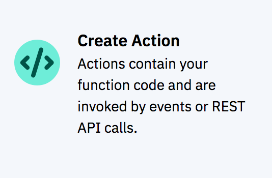
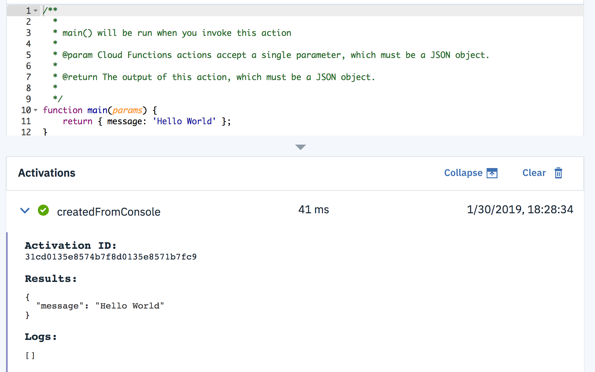
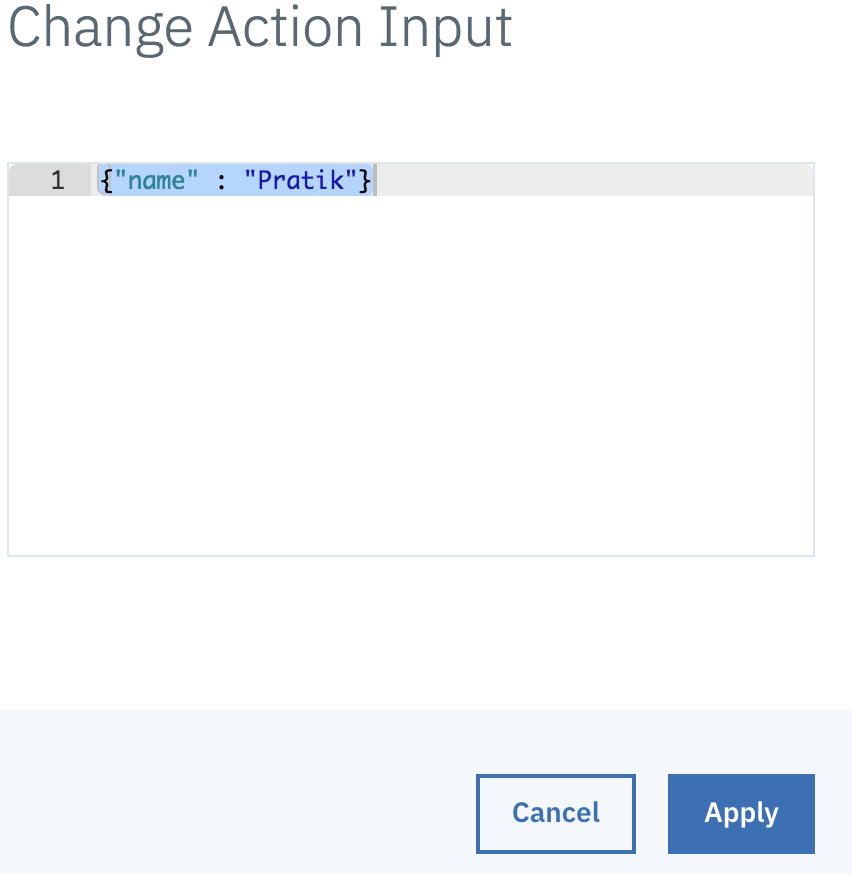
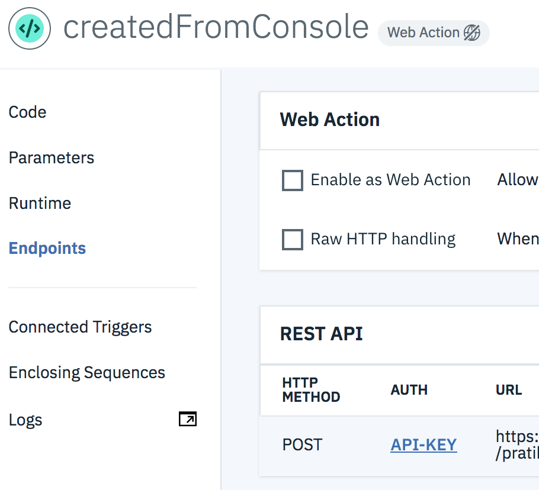

# Exercise 0 - Get to know the Cloud Functions Web Console

We're going to start with a quick tour of the Cloud Functions Web Console. The Web Console will aid you in understanding and debugging as you work through the exercises. We love the command-line, but remembering all those commands can be overwhelming for newcomers, so we suggest going to the Web Console when you need to re-focus on your task.

Make sure you've already setup your account and have the other steps done: [Setup for workshop](https://github.com/prpatel/Serverless-Workshop-Setup-All-Platforms)

## Cloud Functions Web Console Basics

Goals:
* Understand how you can use the console for development and debugging
* Learn how to:
    * Invoke a Cloud Function from the console
    * Set params for a Cloud Function execution
    *  Find the resulting output    
    *  Find the logs messages

Head over to the [Cloud Function Web Console](https://cloud.ibm.com/openwhisk) now and login, if you're not already. You'll see the home screen like below.


### Click on Actions on the left side to see all your created Cloud Functions


### Let's create an Cloud Function right now!

1. Click on the blue button on the right that says "CREATE"
2. You'll see several options, choose:
"Create Action
 Actions contain your function code and are invoked by events or REST API calls."
 
 3. On the next screen enter in these things:
     * Action Name: createdFromConsole
     * Enclosing Package: (leave default, we'll work with packages later)
     * Runtime: (pick Node.js 10 or just leave the default)
     * Click 'CREATE in the bottom right corner'
4. Now we'll see a console with our code
    
5. This is the "Action Details" view   
(NOTE: Don't worry if you don't know JavaScript or are not interested in creating Cloud Functions with it. We're going to use JavaScript in this exercise just for demonstration purposes.)   
   
### Executing and working with the function from the console 
 1. Go ahead and click "INVOKE" on the right side to see your cloud function work!
 2. An invokation of a Cloud Function is called an "Activation". You can see the Activations and the output just below the code now:
  
 3. Things to note:
    * The Activation ID (we'll discuss that in a future exercise)
    * Results (this is JSON,  you'll recognize it from the code in the code editor above this Activations section)
    * Logs (if you produce any logs, they will show here!)

#### Working with parameters in the console
1. Hide the Activations view by clicking the down arrow icon between the code and Activations section  
2. Change the code and add this line before the return:
let name = params.name;
3. Change the return line to look this this:
return { message: 'Hello ' + name };
4. Your code should look like this now:
 
5. Click 'SAVE' on the top right
6. Click 'INVOKE' on the top right
7. The result should say:
{
  "message": "Hello undefined"
}
8. Let's fix that "undefined"! Click on 'Change Input' on the top right
 
9. Enter this in (put your own name in, lol!): {"name" : "Pratik"} 

10. Click APPLY
11. Click INVOKE
12. SUCCESS! You should see your name in the results:
``` 
Results:
{
  "message": "Hello Pratik"
} 
```
#### Create and find log messages
1. Add this line to output a log message (before the return statement):
console.log("params sent to this cloud function:", params)
2. SAVE
3. INVOKE 
4. Now you'll see the Log section has our log output:
 

You can also see logs for previous activations from the [Cloud Functions Dashboard](https://cloud.ibm.com/openwhisk/dashboard). Click on the activation id. 

### Web enable your Cloud Function

Let's see how we can invoke our Cloud Function from a web browser!

1. While still on the "Action details" view, on the left side click ENDPOINTS
   
2. You'll see "ENABLE AS WEB ACTION". Click it!
3. Click SAVE on the top right side
4. A new section appears right below, with a URL ending with your Cloud Function's name:
https://openwhisk.ng.bluemix.net/api/v1/web/pratik.r.patel%nnnnnnnn_dev/default/createdFromConsole.json
5. Copy this URL and paste into a browser! You'll see your Cloud Function's output
6. Of course, we need a parameter of 'name', so add that to the end of the URL and run it, like so: createdFromConsole.json?name=Pratik

## Exercise review

Our objectives in this exercise:

* Understand how you can use the console for development and debugging
* Learn how to:
    * Invoke a Cloud Function from the console
    * Set params for a Cloud Function execution
    *  Find the resulting output    
    *  Find the logs messages
* Invoke a Cloud Function from a Web Browser by enabling it as "Web Action"

***Please ask your friendly workshop instructor if you have any questions!***

## EXTRA CREDIT
So you've finished before everyone else? No problem, here's some more stuff you can dive into!

1. Add another param to the Cloud Function called "location". Change the code to send a result back like: {
                                                                                                            "message": "Hello Pratik from Atlanta!"
                                                                                                          }
2. Under ENDPOINTS, you may have noticed a curl command to invoke this Cloud Function from the command line. Try running it from your terminal!
    * you'll need to substitute the API-KEY with the API-KEY for this Cloud Function. Click where it say "API-KEY" to retrieve it.
3. You may have noticed LOGS on the left side in the menu. Click on it, invoke your function, and see if you can find the log message we inserted into our code.
4. Have a look around the dashboard [Cloud Functions Dashboard](https://cloud.ibm.com/openwhisk/dashboard).
    * Click on an activation id to see it's result and logs
                                                                                                          
 
