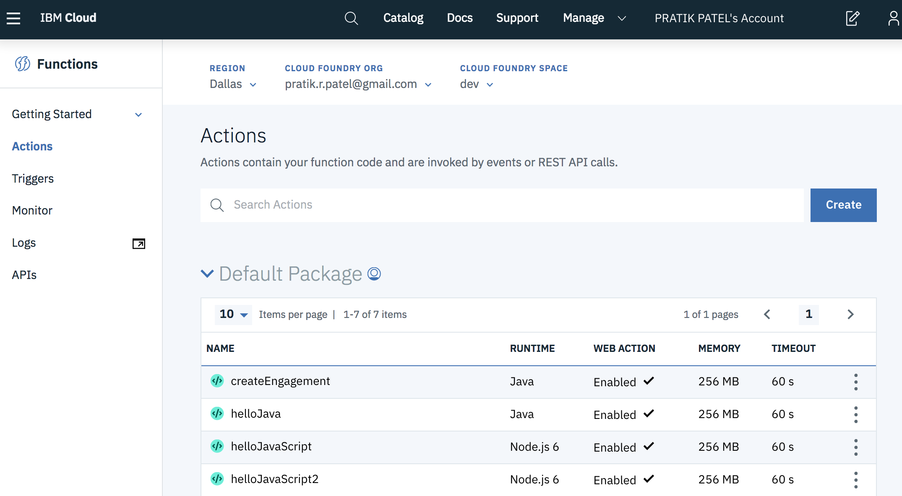

# Exercise 1 - Build and Deploy a Cloud Function from the Command Line

Now that you've setup the command line utilities and gotten a taste of running Cloud Functions from the Web Console, it's time to write some code and deploy it!

Goals:
* Get used to using the CLI to build, deploy and debug development of Cloud Functions, and the structure of Cloud Function code. 
* Learn how to:
    * Examine the source for a  Cloud Function and write one 
    * Build it
    * Deploy it
    * Look at logs messages

## Build and deploy your first Serverless Java App!

Go to the exercise1 folder, then:

1. mvn package  
2. ibmcloud fn action create helloJava target/hello-world-java.jar --main com.example.FunctionApp
3. ibmcloud fn action invoke --result helloJava --param name YOUR_NAME
(please use YOUR_NAME

You should see:
{
    "greetings": "Hello YOUR_NAME"
}

"--result" means just show the results. Omit that, and see what you get back :)
This also adds the "--blocking" flag, discussed below.

#### Open FunctionApp.java in this project and examine it

* We're using the GSON library to work with JSON in Java
* Cloud Functions need a single "main" method with JSON in and JSON out:

``` public static JsonObject main(JsonObject args) ```

* We use the GSON library to parse the JSON args (params) and to create a response in JSON  

### Get to know some OpenWhisk commands

* ibmcloud wsk list
    * note that "wsk" is used here instead of fn! The ibmcloud" command wraps the OpenWhisk "wsk" command with either "fn" or "wsk"!
* ibmcloud wsk action invoke --blocking helloJava
    * this invokes the action in an sync fashion, you'll get a alot of text back, but you're interested in this:
    ***
        "activationId": "13a3f62589214b7da3f62589214b7d1e",
    ***
    * this is what you'll use to get the result back later!
* ibmcloud wsk action invoke helloJava
    * this invokes the action in an sync fashion, with something called an activationId
        ***
            ok: invoked /_/helloJava with id 5923d0321aa04fffa3d0321aa0cfffc2
        ***
        * this is what you'll use to get the result back later!
        * ibmcloud wsk activation result 5923d0321aa04fffa3d0321aa0cfffc2
        ***
                        
            {
                "greetings": "Hello! Welcome to OpenWhisk"
            }
        ***        
    * To  get the last invocation result: ibmcloud wsk activation result --last
    * To get everything (not just result): ibmcloud wsk activation get 5923d0321aa04fffa3d0321aa0cfffc2

    
* ibmcloud fn action update helloJava target/hello-world-java.jar --main com.example.FunctionApp
    * This will update the Cloud Function!              

### What about logs?

* Each activation has logs!
* ibmcloud wsk activation get --last
    * look for  "logs"
* I miss my "tail -f" ... how do I do that?
    * ibmcloud wsk activation poll
    
### 5. To the Web! Let's create Web actions
* To find the URL from which you can invoke an action use this command:
```
ibmcloud wsk action get helloJava --url
```

* But hang on, we haven't told OpenWhisk we want it to be a Web Function! Run this first:
```
ibmcloud fn action update helloJava --web true  
```    

* Check that it's enabled by going to the [IBM Cloud Functions Console](https://cloud.ibm.com/openwhisk/actions)


* Since this Cloud Function just returns JSON, we need to append ".json" to the URL. You can test this by using curl (use your URL that you got from command above):
```
curl -i https://us-south.functions.cloud.ibm.com/api/v1/web/SAMPLE_URL/default/helloJava.json
```
Use the first command in this section to get the URL... don't forget to append .json !

* You can also just paste this URL into the browser!

### 6. Create a HTML Web Cloud Function

So far we've just been creating JSON return values. What if we want to return some HTML?

* Create a new class, called WebHello.java (it's OK to copy FunctionApp.java)

* Change the code so that the response has a body with some HTML, like so:

``` response.addProperty("body", "<html><body><h3>" + result + "</h3></body></html>");  ```

* Create a web-enabled Cloud Function using this command:

``` ibmcloud fn action create webHello target/hello-world-java.jar --main com.example.WebHello --web true ``` 

* Use the command from the previous section to get its URL

``` 
ibmcloud fn action get webHello --url
```
* Invoke it by pasting the URL into the browser. If you appended .json to it, you'll get the it in json format. Do not append .json to it - and you'll see an a message wrapped in an H3 tag!
* What about the name parameter this Cloud Function takes? Append this to the URL:
``` 
webHello?name=Pratik
```
Of course, put your name instead of mine :)  

## Exercise review

Our objectives in this exercise:

* Get used to using the CLI to build, deploy and debug development of Cloud Functions, and the structure of Cloud Function code. 
* Learn how to:
    * Examine the source for a Cloud Function and write one 
    * Build it
    * Deploy it
    * Look at logs messages

***Please ask your friendly workshop instructor if you have any questions!***

## EXTRA CREDIT
So you've finished before everyone else? No problem, here's some more stuff you can dive into!

* Create a more sophisticated Cloud Function called Recipe:
    * Take an parameter called "dish"
    * Take one of these three as valid input for types of dishes: pizza, pasta, chips
    * Return a properly formatted JSON object with the ingredients for each dish. Example output for pizza: 
    ``` 
    {"ingredients" : ["dough", "cheese", "tomato sauce"]
    ```

### Extra Extra Credit
 * Create a HTML Cloud Function that sends an HTML page where you can pick from our foods: dishes: pizza, pasta, chips
 * User selects one of these, and sends to the above Cloud Fn with the param of "dish" 
 * Convert the Cloud Function to return HTML and show the list of ingredients properly formatted
    
   
   
